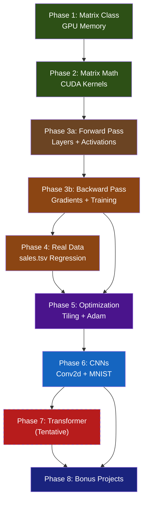

# 🔥 MiniTorch: Build a Neural Network Framework from Scratch in C++ & CUDA

> A phased learning roadmap — from raw GPU memory to CNNs and beyond.
> Each phase has a **clear deliverable** you can run, test, and benchmark against PyTorch.

---

## How This Roadmap Works

- Each **Phase** is self-contained with a working demo at the end.
- Phases are cumulative — Phase 2 imports Phase 1's code and extends it.
- **Difficulty** ramps gradually. If a phase feels easy, skip to the next.
- Every phase lists **new C++ / CUDA concepts** you'll encounter, so you know what to study before or during.
- The `⏱️ Benchmark` sections tell you exactly how to race your code against PyTorch.

### Project Structure (grows with each phase)

```
minitorch/
├── CMakeLists.txt            # Build system (introduced Phase 1)
├── include/
│   └── minitorch/
│       ├── matrix.cuh         # Phase 1
│       ├── ops.cuh            # Phase 2
│       ├── layers.cuh         # Phase 3a
│       ├── activations.cuh    # Phase 3a
│       ├── loss.cuh           # Phase 3b
│       ├── optim.cuh          # Phase 3b
│       ├── dataloader.cuh     # Phase 4
│       ├── conv.cuh           # Phase 6
│       ├── pooling.cuh        # Phase 6
│       ├── attention.cuh      # Phase 7 (tentative)
│       └── transformer.cuh    # Phase 7 (tentative)
├── src/
│   └── (implementations)
├── tests/
│   └── (one test per phase)
├── demos/
│   └── (runnable demos)
├── data/
│   └── sales.tsv
└── benchmarks/
    ├── bench.cu               # C++ benchmark runner
    └── bench_torch.py         # PyTorch baseline
```

---

## Phase 1 — The Matrix: GPU Memory Management

> **Goal**: A `Matrix` class that owns GPU memory and can move data between CPU ↔ GPU.

### What You'll Build

| File | Description |
|------|-------------|
| `include/minitorch/matrix.cuh` | `Matrix` class header |
| `src/matrix.cu` | Implementation |
| `tests/test_matrix.cu` | Verify round-trip CPU→GPU→CPU is lossless |
| `CMakeLists.txt` | Build with `nvcc` |

### The `Matrix` Class — Member Variables

```cpp
class Matrix {
    float* d_data;   // pointer to GPU memory (device)
    int rows;
    int cols;
};
```

### What You Need to Implement

1. **Constructor** — `cudaMalloc` a block of `rows * cols * sizeof(float)` on the GPU.
2. **Destructor** — `cudaFree` the memory (RAII — the GPU equivalent of cleaning up after yourself).
3. **`to_device(float* host_data)`** — `cudaMemcpy` from CPU → GPU.
4. **`to_host(float* host_buffer)`** — `cudaMemcpy` from GPU → CPU.
5. **`fill(float value)`** — A CUDA kernel that sets every element to `value`.
6. **`print()`** — Copies to host, prints a formatted matrix to stdout.

### New Concepts You'll Learn

| Concept | Why It Matters |
|---------|---------------|
| `cudaMalloc` / `cudaFree` | Manual GPU memory management — no garbage collector |
| `cudaMemcpy` | The bridge between CPU and GPU worlds |
| RAII (Resource Acquisition Is Initialization) | C++ pattern: constructor acquires, destructor releases |
| CMake with CUDA | Building `.cu` files with `nvcc` through CMake |

### ✅ Deliverable

A program that:

1. Creates a 4×4 `Matrix` on the GPU
2. Fills it with `3.14` using a CUDA kernel
3. Copies it back to CPU and prints it
4. Destructor automatically frees GPU memory

### ⏱️ Benchmark

None yet — this is plumbing. But you can time `cudaMalloc` + `cudaMemcpy` for large matrices (e.g. 4096×4096) vs `torch.randn(4096, 4096).cuda()` to feel the overhead.

---

## Phase 2 — Matrix Math: Your First Real Kernels

> **Goal**: Implement matrix operations as CUDA kernels. Naive first — correctness over speed.

### What You'll Build

| File | Description |
|------|-------------|
| `include/minitorch/ops.cuh` | Kernel declarations |
| `src/ops.cu` | Kernel implementations |
| `tests/test_ops.cu` | Compare results against known answers |

### Operations to Implement

Each operation is a CUDA kernel where each thread handles one element (or one output element for matmul):

| Operation | Kernel Signature | Thread Strategy |
|-----------|-----------------|-----------------|
| Element-wise Add | `add(A, B, C, n)` | 1 thread per element |
| Element-wise Multiply | `multiply(A, B, C, n)` | 1 thread per element |
| Scalar Multiply | `scalar_mul(A, scalar, C, n)` | 1 thread per element |
| Matrix Transpose | `transpose(A, B, rows, cols)` | 1 thread per element |
| **Matrix Multiply** | `matmul(A, B, C, M, N, K)` | 1 thread per output element |

### The Naive MatMul Kernel — Your Main Challenge

```cpp
// Each thread computes one element of C
// C[row][col] = sum over k of A[row][k] * B[k][col]
__global__ void matmul(float* A, float* B, float* C, int M, int N, int K) {
    int row = blockIdx.y * blockDim.y + threadIdx.y;
    int col = blockIdx.x * blockDim.x + threadIdx.x;

    if (row < M && col < N) {
        float sum = 0.0f;
        for (int k = 0; k < K; k++) {
            sum += A[row * K + k] * B[k * N + col];
        }
        C[row * N + col] = sum;
    }
}
```

### New Concepts You'll Learn

| Concept | Why It Matters |
|---------|---------------|
| 2D grid/block layout | Mapping thread IDs to matrix indices |
| Row-major indexing | `A[i][j]` = `A[i * cols + j]` in flat memory |
| Grid sizing math | `dim3 grid(ceil(N/16), ceil(M/16))` |
| Numerical validation | Floating point is tricky — use tolerances |

### ✅ Deliverable

A program that:

1. Creates two random matrices A (128×64) and B (64×128)
2. Multiplies them using your CUDA kernel → C
3. Multiplies them on CPU (triple for-loop) → C_ref
4. Prints max absolute error between C and C_ref (should be < 1e-4)

### ⏱️ Benchmark

```
Your matmul:          _____ ms  (1024×1024 matrices)
PyTorch torch.mm():   _____ ms
Ratio:                _____x slower  (expect 10-50x — that's fine!)
```

---

## Phase 3a — The Forward Pass: Making Predictions (No Training Yet)

> **Goal**: Build `Linear` and `Sigmoid` layers that can compute a forward pass with hardcoded weights.

This is the first half of the neural network story. You're wiring up layers that transform input → output, but you **won't train anything yet**. Think of it as building the engine before adding the fuel.

### What You'll Build

| File | Description |
|------|-------------|
| `include/minitorch/activations.cuh` | Sigmoid, ReLU forward kernels |
| `include/minitorch/layers.cuh` | `Linear` layer class (forward only) |
| `src/activations.cu` | Kernel implementations |
| `src/layers.cu` | Linear forward |
| `tests/test_forward.cu` | Verify forward pass against hand-calculated values |

### The `Linear` Layer — Forward Only

```cpp
class Linear {
    Matrix weights;      // (in_features × out_features)
    Matrix bias;         // (1 × out_features)

    Matrix forward(const Matrix& input);
    // output = input @ weights + bias
};
```

### What You Need to Implement

1. **`Linear::forward(input)`** — Uses your `matmul` kernel from Phase 2, then adds bias with your `add` kernel.
2. **`sigmoid_forward(input, output)`** — Element-wise kernel: `output[i] = 1.0f / (1.0f + expf(-input[i]))`.
3. **`relu_forward(input, output)`** — Element-wise kernel: `output[i] = fmaxf(0.0f, input[i])`.
4. **Manual weight setting** — A method to copy specific float values into `weights` and `bias` from the CPU.

### New Concepts You'll Learn

| Concept | Why It Matters |
|---------|---------------|
| Composing kernels | Output of one kernel → input of the next |
| Broadcasting bias | Adding a (1×D) bias to every row of a (B×D) matrix |
| `expf()` in CUDA | Device-side math functions (not `std::exp`) |
| Layer as a class | Encapsulating weights + computation together |

### ✅ Deliverable

A program that:

1. Creates a `Linear(2, 3)` layer and manually sets weights and biases to known values
2. Creates a `Linear(3, 1)` layer with known weights
3. Passes input `[[1.0, 2.0], [3.0, 4.0]]` through: `Linear(2,3) → Sigmoid → Linear(3,1)`
4. Prints the output and **verifies it matches a hand-calculated expected value** (compute this on paper or in Python first)

### ⏱️ Benchmark

None — this is about correctness, not speed. But you're building the pieces that Phase 3b will wire into a training loop.

---

## Phase 3b — The Backward Pass: Learning from Mistakes

> **Goal**: Add backward passes to every layer + SGD optimizer. Train XOR.

This is the intellectual core of the project. You're implementing what PyTorch's `.backward()` does, but explicitly — calling each layer's backward function yourself in reverse order.

### What You'll Build

| File | Description |
|------|-------------|
| `include/minitorch/loss.cuh` | MSE loss (forward + backward) |
| `include/minitorch/optim.cuh` | SGD optimizer |
| `src/loss.cu` | Loss computation |
| `src/optim.cu` | Parameter updates |
| `tests/test_backward.cu` | **Gradient checking** with finite differences |

### Files You'll Modify

| File | Changes |
|------|---------|
| `include/minitorch/layers.cuh` | Add `backward()`, `grad_weights`, `grad_bias`, `input_cache` |
| `include/minitorch/activations.cuh` | Add `sigmoid_backward`, `relu_backward` kernels |
| `src/layers.cu` | Implement `Linear::backward()` |
| `src/activations.cu` | Implement backward kernels |

### The Chain Rule — Manually

Unlike micrograd where each `Value` node tracked its own gradient, here you pass gradient matrices explicitly through each layer in reverse.

**Forward pass** (compute output):

```
Input → Linear(W, b) → Sigmoid → Linear(W2, b2) → MSE Loss → scalar loss
```

**Backward pass** (compute gradients — you call these yourself in reverse order):

```
loss.backward(predictions, targets)        → dL/d_pred
linear2.backward(dL/d_pred)                → dL/d_sigmoid, dW2, db2
sigmoid.backward(dL/d_sigmoid)             → dL/d_linear1
linear1.backward(dL/d_linear1)             → dW1, db1
```

### Updated Layer Interface

```cpp
class Linear {
    Matrix weights;      // (in_features × out_features)
    Matrix bias;         // (1 × out_features)
    Matrix grad_weights; // same shape as weights  ← NEW
    Matrix grad_bias;    // same shape as bias     ← NEW
    Matrix input_cache;  // saved for backward     ← NEW

    Matrix forward(const Matrix& input);
    Matrix backward(const Matrix& grad_output);    // ← NEW: returns grad_input
};
```

### Gradient Checking — Your Debugging Lifeline

For every operation, verify your analytical gradient against a numerical one:

```
numerical_grad = (f(x + ε) - f(x - ε)) / (2 * ε)    where ε = 1e-5
```

If `|analytical - numerical| < 1e-4`, your backward pass is correct.

### New Concepts You'll Learn

| Concept | Why It Matters |
|---------|---------------|
| Storing intermediate values | Forward saves `input_cache` for backward |
| Gradient shapes | If forward takes (B×D_in) → (B×D_out), backward grad is (B×D_out) |
| Finite difference gradient checking | `(f(x+ε) - f(x-ε)) / 2ε` — your debugging lifeline |
| SGD parameter update | `W -= lr * dW` — element-wise kernel |
| The training loop | forward → loss → backward → update → repeat |

### ✅ Deliverable

A program that:

1. Creates a 2-layer network: `Linear(2, 4) → Sigmoid → Linear(4, 1)`
2. Generates XOR-like data: `[(0,0)→0, (0,1)→1, (1,0)→1, (1,1)→0]`
3. Trains for 5000 epochs with SGD
4. Prints loss every 500 epochs — it should **decrease toward ~0**
5. Prints predictions — they should approximate the XOR truth table

### ⏱️ Benchmark

```
Your XOR training (5000 epochs):   _____ ms
PyTorch equivalent:                _____ ms
```

---

## Phase 4 — Real Data: TSV Loading & Batch Training

> **Goal**: Load `sales.tsv` (~366K rows of retail transaction data), engineer features, and train a regression model to predict total sale price.

### The Dataset: `sales.tsv`

Your own data — tab-separated, no header row. Columns:

| Col | Field | Type | Example |
|-----|-------|------|---------|
| 1 | Product name | string | `Ruby Viet Rice 5 % Broken 22.5Kg` |
| 2 | Product code | string | `TY00015` |
| 3 | Date | string | `2022-04-01` |
| 4 | Timestamp | string | `2022-05-08 20:54:08.797` |
| 5 | Quantity | float | `1.0` |
| 6 | Unit price | float | `195.0` |
| 7 | **Category** | string | `Rice` |
| 8 | User | string | `ADMIN` |
| 9 | **Total price** | float | `195.0` ← **prediction target** |
| 10 | ID | int | `2` |

### What You'll Build

| File | Description |
|------|-------------|
| `include/minitorch/dataloader.cuh` | TSV parser + batch iterator |
| `src/dataloader.cu` | Implementation |
| `demos/demo_sales.cu` | Train regression model on sales data |

### Feature Engineering (keep it simple)

| Feature | How to Extract |
|---------|---------------|
| `quantity` | Column 5 — direct float |
| `unit_price` | Column 6 — direct float |
| `category` | Column 7 — one-hot encode (~16 categories) |
| `day_of_year` | Column 3 — parse date, compute day number (1–365) |

**Target**: Column 9 (`total_price`) — this is a regression problem.

> [!TIP]
> Start with just `quantity` and `unit_price` as features. The model should learn that `total = quantity × unit_price`. Once that works, add category and date features to see if they improve predictions on held-out data.

### Operations to Add

| Operation | Description |
|-----------|-------------|
| TSV parsing | Read tab-separated fields, extract numeric columns (C++ `fstream` + `getline`) |
| Feature normalization | Subtract mean, divide by std — CUDA kernels on each column |
| Mini-batch iteration | Slice dataset into batches of size B, shuffle between epochs |
| Train/test split | First 80% for training, last 20% for testing |

### New Concepts You'll Learn

| Concept | Why It Matters |
|---------|---------------|
| C++ file I/O (`fstream`, `getline`) | Loading real data without Python |
| `std::vector` ↔ raw arrays | Converting between C++ containers and CUDA-friendly memory |
| String parsing (`std::stof`, `std::stoi`) | Extracting numbers from text fields |
| One-hot encoding | Turning category strings into numeric vectors |
| Feature normalization on GPU | Mean/std reduction kernels — a fundamental GPU pattern |
| Regression vs classification | MSE loss is appropriate here (not cross-entropy) |

### ✅ Deliverable

A program that:

1. Loads `sales.tsv` and extracts features + target
2. Normalizes features to zero mean, unit variance
3. Splits into train (~293K) / test (~73K)
4. Trains a `Linear(n_features, 32) → ReLU → Linear(32, 1)` network with mini-batches
5. Prints training loss and **test MAE (mean absolute error)** each epoch
6. Achieves a **test MAE** meaningfully lower than the baseline (predicting the mean)

### ⏱️ Benchmark

```
Your sales training (50 epochs):   _____ ms
PyTorch equivalent:                _____ ms
Memory used (nvidia-smi):          _____ MB
Dataset size:                      ~366K rows
```

---

## Phase 5 — Growing Up: Optimization & Abstractions

> **Goal**: Make your framework faster and more ergonomic before tackling complex architectures.

### What You'll Improve

| Area | Change |
|------|--------|
| **MatMul** | Shared memory tiled kernel (the classic optimization) |
| **Memory** | Implement a simple memory pool to avoid repeated `cudaMalloc` calls |
| **API** | Create a `Sequential` container: `auto model = Sequential({Linear(4,16), ReLU(), Linear(16,3)})` |
| **Optimizer** | Implement Adam (momentum + adaptive learning rates) |
| **Initialization** | Xavier/He weight initialization using `cuRAND` |

### Tiled MatMul — The Big Optimization

This is the concept that separates "I know CUDA" from "I understand GPU architecture":

```
Shared memory tile (e.g. 16×16):
1. Each thread block loads a tile of A and B into shared memory
2. Threads compute partial sums using the fast shared memory
3. Sync threads, load next tile, repeat
4. Write final result to global memory
```

### New Concepts You'll Learn

| Concept | Why It Matters |
|---------|---------------|
| `__shared__` memory | 100x faster than global memory, but tiny (~48KB) |
| `__syncthreads()` | Barrier synchronization within a block |
| Memory coalescing | Adjacent threads should access adjacent memory |
| `cuRAND` | GPU-side random number generation |
| Operator overloading | `Matrix C = A * B;` instead of `matmul(A, B, C, ...)` |

### ✅ Deliverable

1. Tiled matmul passes the same correctness tests as Phase 2
2. `Sequential` API works to define and train the sales model from Phase 4
3. Adam optimizer converges faster than SGD on the same problem

### ⏱️ Benchmark

```
Naive matmul (1024×1024):      _____ ms  (from Phase 2)
Tiled matmul (1024×1024):      _____ ms  (should be 3-10x faster)
cuBLAS (for reference):        _____ ms  (the ceiling)
PyTorch:                       _____ ms
```

---

## Phase 6 — Convolutional Neural Networks: Seeing Patterns

> **Goal**: Implement `Conv2d`, `MaxPool2d`, and train a CNN on MNIST handwritten digits.

This phase introduces a fundamentally different kernel pattern: instead of matrix math, you're sliding a small filter across a 2D image. It's also your first time working with **4D tensors** (batch × channels × height × width).

### What You'll Build

| File | Description |
|------|-------------|
| `include/minitorch/conv.cuh` | `Conv2d` layer (forward + backward) |
| `include/minitorch/pooling.cuh` | `MaxPool2d` layer (forward + backward) |
| `src/conv.cu` | Convolution kernels |
| `src/pooling.cu` | Pooling kernels |
| `demos/demo_mnist.cu` | Train CNN on MNIST |
| `data/mnist/` | MNIST dataset (binary format) |

### The Convolution Kernel — Naive Version

Each output pixel is a dot product of the filter with a patch of the input:

```cpp
// For each output pixel (b, oc, oh, ow):
//   sum over (ic, kh, kw) of input[b][ic][oh+kh][ow+kw] * filter[oc][ic][kh][kw]
__global__ void conv2d_forward(
    float* input,   // (B, C_in, H, W)
    float* filter,  // (C_out, C_in, KH, KW)
    float* output,  // (B, C_out, H_out, W_out)
    int B, int C_in, int H, int W,
    int C_out, int KH, int KW
) {
    // 1 thread per output element
    // 6 nested conceptual loops, but thread handles the outer 4
}
```

### Network Architecture for MNIST

```
Input (1×28×28)
  → Conv2d(1, 8, kernel=3, padding=1)      → (8×28×28)
  → ReLU
  → MaxPool2d(2)                             → (8×14×14)
  → Conv2d(8, 16, kernel=3, padding=1)      → (16×14×14)
  → ReLU
  → MaxPool2d(2)                             → (16×7×7)
  → Flatten                                  → (784)
  → Linear(784, 64) → ReLU → Linear(64, 10)
  → Softmax + CrossEntropy
```

### Operations to Add

| Operation | Description |
|-----------|-------------|
| Softmax | Multi-class output — row-wise reduction kernel |
| Cross-Entropy Loss | Replace MSE for classification |
| Conv2d forward | Sliding filter dot products |
| Conv2d backward | Gradient w.r.t. input (full convolution) and filters |
| MaxPool2d forward | Take max in each 2×2 window |
| MaxPool2d backward | Route gradient to the max element (store indices) |
| Flatten | Reshape 4D → 2D (just pointer math, no kernel needed) |

### New Concepts You'll Learn

| Concept | Why It Matters |
|---------|---------------|
| 4D tensor indexing | `data[b * C*H*W + c * H*W + h * W + w]` — nested flat indexing |
| Convolution as parallel dot products | Each thread computes one output pixel |
| Padding | Handling boundary conditions in the kernel |
| MaxPool backward | Storing argmax indices for gradient routing |
| Softmax numerical stability | Subtracting max prevents `exp()` overflow |
| Cross-entropy gradient | `softmax_output - one_hot_target` — surprisingly simple |
| MNIST binary format | Reading IDX file format (custom binary parser) |

### ✅ Deliverable

A program that:

1. Loads MNIST (60K train, 10K test — 28×28 grayscale images)
2. Trains the CNN architecture above for 10 epochs with mini-batches of 64
3. Prints training loss and **test accuracy** each epoch
4. Achieves **>95% test accuracy** on MNIST

### ⏱️ Benchmark

```
Your CNN MNIST (10 epochs):    _____ ms
PyTorch equivalent:            _____ ms
Test accuracy:                 _____ %
Memory used (nvidia-smi):      _____ MB
```

---

## Phase 7 *(Tentative)* — The Transformer: Attention Is All You Need

> **Goal**: Implement self-attention and a small Transformer encoder from scratch.
>
> ⚠️ *This phase is tentative — we'll decide whether to tackle it based on how Phases 1–6 go.*

### What You'll Build

| File | Description |
|------|-------------|
| `include/minitorch/attention.cuh` | Scaled dot-product attention |
| `include/minitorch/transformer.cuh` | TransformerBlock, positional encoding |
| `src/attention.cu` | Attention kernels |
| `src/transformer.cu` | Full block implementation |
| `demos/demo_transformer.cu` | Character-level language model |
| `data/tiny_shakespeare.txt` | Training corpus |

### Attention Mechanism — Broken Down

```
Attention(Q, K, V) = softmax(Q @ K^T / sqrt(d_k)) @ V
```

This decomposes into operations you already have:

1. `matmul(Q, transpose(K))` → scores
2. `scalar_mul(scores, 1/sqrt(d_k))` → scaled scores
3. `softmax(scaled_scores)` → attention weights
4. `matmul(attention_weights, V)` → output

The new challenge: **multi-head attention** splits Q, K, V into `h` heads, runs attention on each, and concatenates.

### TransformerBlock

```
Input → LayerNorm → MultiHeadAttention → + (residual) → LayerNorm → FFN → + (residual) → Output
```

New components needed:

- **LayerNorm** — normalize across features (not batch) — another reduction kernel
- **Residual connections** — just element-wise add, you already have this
- **Feed-Forward Network** — `Linear → ReLU → Linear`, you already have this
- **Causal masking** — set future positions to `-inf` before softmax

### New Concepts You'll Learn

| Concept | Why It Matters |
|---------|---------------|
| Multi-head attention | The core innovation of Transformers |
| Masking | Preventing the model from "seeing the future" |
| LayerNorm vs BatchNorm | Different normalization strategies, different kernels |
| Tokenization (basic) | Character-level: each char → integer index |
| Embedding lookup | A matrix index operation, not a matmul |

### ✅ Deliverable

A program that:

1. Tokenizes Tiny Shakespeare at the character level
2. Builds a 2-layer Transformer with 4 attention heads, d_model=64
3. Trains on next-character prediction for ~1000 steps
4. Generates 200 characters of text — it should look "Shakespeare-ish" (not random garbage)

### ⏱️ Benchmark

```
Your Transformer (1000 steps):    _____ ms
PyTorch equivalent:               _____ ms
Generated text quality:           (subjective — does it look like words?)
```

---

## Phase 8 (Bonus) — The Optimizer's Playground

> These are independent mini-projects you can tackle in any order once the core phases are done.

| Project | What You'll Learn |
|---------|-------------------|
| **Flash Attention** | Fused kernel that avoids materializing the full attention matrix — major memory savings |
| **Mixed Precision (FP16)** | Use `__half` type, `wmma` tensor core intrinsics — 2-4x speedup |
| **Custom Autograd** | Build a computation graph like micrograd, but in C++ with CUDA ops |
| **Model Serialization** | Save/load weights to disk — binary file I/O in C++ |
| **Python Bindings** | Use `pybind11` to call your CUDA code from Python |
| **Profiling Deep Dive** | Use `nsys` and `ncu` to profile and optimize your kernels |

---

## Appendix: Benchmark Template

Save this as `benchmarks/bench_torch.py` and fill in as you go:

```python
import torch
import time

def bench_matmul(size=1024, warmup=10, trials=100):
    A = torch.randn(size, size, device='cuda')
    B = torch.randn(size, size, device='cuda')

    # Warmup
    for _ in range(warmup):
        C = torch.mm(A, B)
    torch.cuda.synchronize()

    # Timed
    start = time.perf_counter()
    for _ in range(trials):
        C = torch.mm(A, B)
    torch.cuda.synchronize()
    elapsed = (time.perf_counter() - start) / trials * 1000

    print(f"PyTorch matmul ({size}x{size}): {elapsed:.3f} ms")

def bench_mlp_xor(epochs=5000):
    import torch.nn as nn
    model = nn.Sequential(nn.Linear(2, 4), nn.Sigmoid(), nn.Linear(4, 1)).cuda()
    X = torch.tensor([[0,0],[0,1],[1,0],[1,1]], dtype=torch.float32).cuda()
    y = torch.tensor([[0],[1],[1],[0]], dtype=torch.float32).cuda()
    opt = torch.optim.SGD(model.parameters(), lr=0.5)
    loss_fn = nn.MSELoss()

    start = time.perf_counter()
    for _ in range(epochs):
        opt.zero_grad()
        loss = loss_fn(model(X), y)
        loss.backward()
        opt.step()
    torch.cuda.synchronize()
    elapsed = (time.perf_counter() - start) * 1000
    print(f"PyTorch XOR ({epochs} epochs): {elapsed:.3f} ms, final loss: {loss.item():.6f}")

def bench_sales_mlp(epochs=50):
    """Fill this in during Phase 4"""
    pass

def bench_mnist_cnn(epochs=10):
    """Fill this in during Phase 6"""
    pass

if __name__ == "__main__":
    bench_matmul()
    bench_mlp_xor()
```

---

## Quick Reference: Phase Dependencies



**Legend**: 🟢 Foundations → 🟤 Neural Networks → 🟣 Optimization → 🔵 CNNs → 🔴 Transformers *(tentative)* → 🔵 Expert

---

## Getting Started — Right Now

**Prerequisites**:

- NVIDIA GPU with CUDA toolkit installed (`nvcc --version` should work)
- CMake ≥ 3.18
- A C++ compiler (comes with CUDA toolkit)
- PyTorch with CUDA (for benchmarks only)

**First step**: Create `CMakeLists.txt`, `include/minitorch/matrix.cuh`, and `src/matrix.cu`.
We'll build Phase 1 together.
